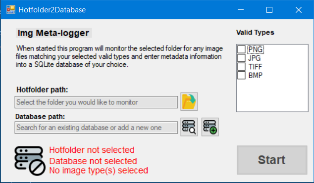

# Hotfolder2database

This is an example project to show my coding habits as of 2020-05-11.
It uses Winforms as UI and SQLite as backend.

The project itself allows the user to select a folder which will be monitored by Windows FileSystemWatcher.
Once an image file (png, bmp, tiff or jpg) is put into the folder it will have some metadata collected
and the information put into a SQLite database. The files will then either be moved to a
/success/ subfolder in the case of successfull parsing, or a /failed/ subfolder in the case of failure.
All entries will also be logged.

I can't really think of any real life use of this program but I didn't anything to show on my Git and I needed an example prompto! :)
My hope is that it will give us something to discuss, and that I will learn more tricks while I refactor and expand upon the codebase.

Icons made by Pixel perfect and Smashicons from www.flaticon.com

// Fredrik Arvidsson
